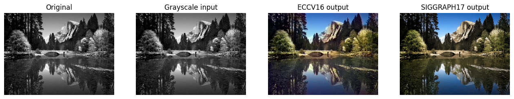

# Black & White Image Colorization (PyTorch)

Colorizes black-and-white photos using two pretrained deep learning models from the official [richzhang/colorization](https://github.com/richzhang/colorization) repository, and compares their outputs side by side.

## What it does

1. Installs dependencies and clones the official `colorization` repo, which contains the model code and pretrained weights.
2. Loads two pretrained colorization models: **ECCV16** and **SIGGRAPH17** (weights auto-download on first run).
3. Loads a sample grayscale image (or a custom one you provide) and preprocesses it to the format the models expect.
4. Runs both models on the same input image.
5. Displays four images side by side: the original, the grayscale input, the ECCV16 result, and the SIGGRAPH17 result.

## Concepts covered

- **Lab color space** — these models work in Lab color space rather than RGB. The "L" (lightness) channel is essentially the grayscale image; the models predict the missing "a" and "b" (color) channels from it. This is why the input only needs the lightness channel — that's literally what a black-and-white photo already is.
- **ECCV16 vs. SIGGRAPH17** — two different pretrained colorization models from the same research group, trained with different techniques/publication years; comparing them side by side shows how model choice affects colorization style and quality on the same input.
- **Pretrained models / transfer learning** — no training happens in this script; both models ship with weights already learned from large image datasets, so colorization works immediately without any training step.
- **CPU vs. GPU inference** — the `use_gpu` flag controls whether tensors are moved to CUDA before running inference; this only matters for speed, not correctness — both give the same results, GPU is just faster.

## Project structure

```
main.py      # full pipeline, organized into functions (config, model loading,
              # image preprocessing, colorization, visualization)
README.md    # this file
```

The install/clone commands (`!pip install`, `!git clone`, `%cd`) are Colab notebook magics and stay at the top as-is — they have to run before the imports that depend on the cloned repo. Everything after that is organized into small, named functions driven by a `PipelineConfig` dataclass — `load_colorizers`, `load_and_preprocess_image`, `colorize`, `show_results` — tied together by `run_pipeline()`.

## Requirements

This script is written for a Google Colab notebook — it uses `!pip install` and `%cd` magic commands, which only work in Jupyter/Colab cells, not as a plain `.py` script run from the terminal.

```
torch
torchvision
scikit-image
matplotlib
```

Also requires `git` (to clone the model repo) and internet access (to download pretrained weights on first run).

## How to run

1. Open this file in a Google Colab notebook (paste the cells in, in order).
2. Run all cells top to bottom — this calls `run_pipeline()` at the end automatically.
3. To use your own image instead of the repo's sample: upload your image to the Colab session, then update `PipelineConfig.img_path` to point to your uploaded filename.
4. To use a GPU: enable a GPU runtime in Colab (Runtime → Change runtime type → GPU), then set `PipelineConfig.use_gpu = True`.

## Sample output

Running the script displays the original image, the grayscale input, and both models' colorized outputs side by side.

**Colorization comparison**



## References

- [GeeksforGeeks — Machine Learning Projects](https://www.geeksforgeeks.org/machine-learning/machine-learning-projects/) — used as a general reference/inspiration while working on this project.


---
*This is a personal learning project, not a production colorization tool.*
