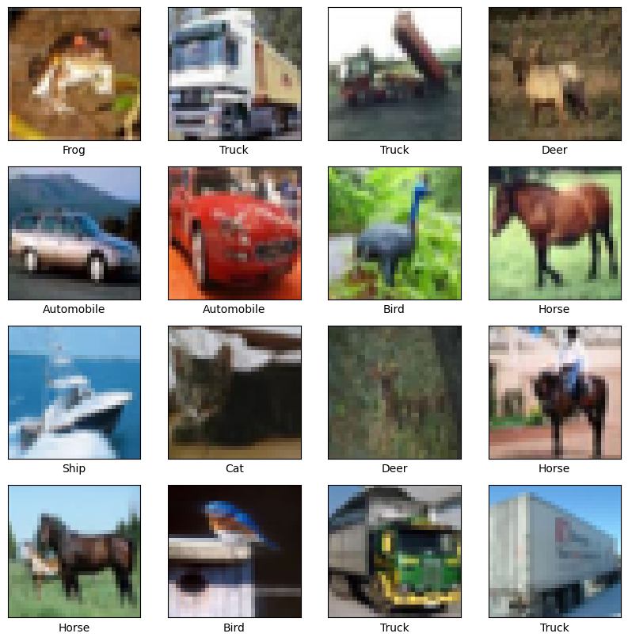
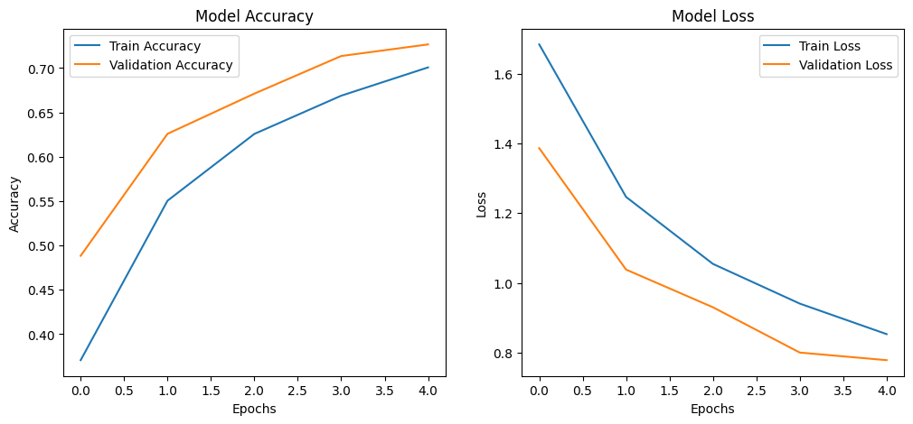

# CIFAR-10 Image Classification with a CNN

A convolutional neural network that classifies 32x32 color images into 10 categories (airplane, automobile, bird, cat, deer, dog, frog, horse, ship, truck) using the CIFAR-10 dataset.

## What it does

1. Loads CIFAR-10, normalizes pixel values to `[0, 1]`, and one-hot encodes the integer class labels.
2. Displays a 4x4 grid of sample training images with their class names.
3. Builds a CNN with three convolutional blocks (each: two `Conv2D` layers → `MaxPooling2D` → `Dropout`), increasing filter counts (32 → 64 → 128) as spatial resolution shrinks, followed by a dense classification head.
4. Trains the model with a held-out validation split.
5. Evaluates the trained model on the separate test set and prints final loss/accuracy.
6. Plots training vs. validation accuracy and loss curves side by side.

## Concepts covered

- **Convolutional blocks with increasing depth** — each block doubles the number of filters (32→64→128) while pooling halves the spatial dimensions, a common CNN pattern that trades spatial resolution for richer feature representations as the network gets deeper.
- **Dropout for regularization** — dropout layers (0.25 after each conv block, 0.5 before the final classifier) randomly deactivate neurons during training, reducing overfitting by preventing the network from relying too heavily on any single feature path.
- **`categorical_crossentropy` vs. `sparse_categorical_crossentropy`** — since labels are one-hot encoded here (not plain integers), `categorical_crossentropy` is the correct loss function; using `sparse_categorical_crossentropy` would require integer labels instead.
- **Validation split vs. test set** — `validation_split=0.2` carves out part of the *training* data to monitor overfitting during training, which is different from the separate *test* set used only for a final, unbiased accuracy check after training is complete.
- **Idempotent one-hot encoding check** — checking `y_train.dtype == np.uint8` before calling `to_categorical` avoids accidentally one-hot-encoding labels that are already one-hot (which would raise an error, since one-hot arrays are `float`, not `uint8`).

## Project structure

```
main.py      # full pipeline, organized into functions (config, data loading,
              # preview, model architecture, training, evaluation, visualization)
README.md    # this file
```

The code is organized into small, named functions driven by a `PipelineConfig` dataclass — `load_data`, `preview_samples`, `build_model`, `train_model`, `evaluate_model`, `plot_training_curves` — tied together by `run_pipeline()`.

## Requirements

```
tensorflow
numpy
matplotlib
```

Install with:

```bash
pip install tensorflow numpy matplotlib
```

## How to run

```bash
python main.py
```

CIFAR-10 downloads automatically via `tf.keras.datasets.cifar10.load_data()` on first run — no separate dataset file needed.

## Sample output

Running the script shows a grid of sample images, trains for 30 epochs (this takes a while on CPU — a GPU is recommended), prints final test accuracy, and plots accuracy/loss curves.

**Sample training images**



**Training curves**




## Things I'd like to try next

- Add data augmentation (`RandomFlip`, `RandomRotation`, etc.) to reduce overfitting further and likely improve test accuracy.
- Add a confusion matrix on the test set predictions to see which classes get confused most often (e.g. cat vs. dog).
- Try `EarlyStopping` and `ReduceLROnPlateau` callbacks to avoid training a fixed 30 epochs regardless of whether the model has already converged.
- Compare this custom CNN against a pretrained backbone (e.g. `MobileNetV2`) fine-tuned on CIFAR-10.

## References

- [GeeksforGeeks — Machine Learning Projects](https://www.geeksforgeeks.org/machine-learning/machine-learning-projects/) — used as a general reference/inspiration while working on this project.


---
*This is a personal learning project, not a production image classifier.*
