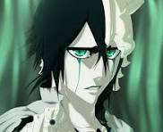
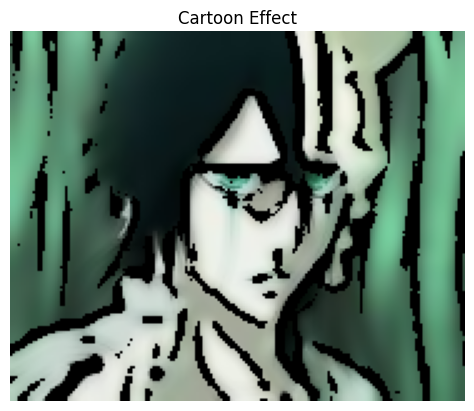

# Cartoon Effect Image Filter (OpenCV)

A classic image-processing technique that gives a photo a hand-drawn "cartoon" look, using only OpenCV filters — no machine learning involved. It works by combining bold black outlines (edge detection) with a smoothed, posterized-looking color image.

## What it does

1. Loads the source image, raising a clear error if the file can't be found.
2. Extracts a black-and-white **edge mask**: converts to grayscale, denoises with a median blur, then applies adaptive thresholding so edges become bold black lines while flat regions stay white.
3. Applies a **bilateral filter** to the original color image — this smooths flat color regions (like a cartoon's flat shading) while still preserving sharp edges, unlike a normal blur which would blur everything including edges.
4. Combines the two with `bitwise_and`, using the edge mask to "cut out" the smoothed color image, so edges appear as black outlines over flat color areas.
5. Displays the result and saves it to disk.

## Concepts covered

- **Adaptive thresholding** — instead of picking one global brightness threshold for the whole image, `adaptiveThreshold` computes a local threshold for each region, which handles images with uneven lighting much better than a single fixed cutoff.
- **Median blur** — replaces each pixel with the median of its neighborhood, which reduces noise while preserving edges better than a plain average (Gaussian) blur — important here since noisy edges would make the outline mask look speckled.
- **Bilateral filtering** — a smoothing filter that respects edges: it blurs based on both spatial distance *and* color similarity, so it flattens color within regions without blurring across strong edges. This is what gives the "flat cartoon shading" look instead of an overall blurry photo.
- **Bitwise masking** — `bitwise_and(smoothed, smoothed, mask=edges)` uses the binary edge mask to control which pixels of the smoothed image get kept, effectively "painting" the black outlines onto the smoothed color image.

## Project structure

```
main.py      # full pipeline, organized into functions (config, image loading,
              # edge extraction, color smoothing, compositing, display, saving)
README.md    # this file
```

The code is organized into small, named functions driven by a `PipelineConfig` dataclass — `load_image`, `extract_edge_mask`, `smooth_color`, `cartoonize`, `show_image` — tied together by `run_pipeline()`.

## Requirements

```
opencv-python
matplotlib
```

Install with:

```bash
pip install opencv-python matplotlib
```

## How to run

Place your source image (e.g. `Ulquiorra.jpg`) in the same directory as `main.py`, then:

```bash
python main.py
```

The cartoonized result is displayed and saved as `cartoon_output.jpg`.

## Sample output

**Original**



**Cartoon effect result**




## Things I'd like to try next

- Try different `edge_block_size`/`edge_c` combinations to see how outline thickness/sensitivity changes.
- Add color quantization (e.g. k-means on pixel colors) before the bilateral filter for an even more "flat cartoon" palette.
- Batch-process a folder of images instead of a single hardcoded file.

## References

- [GeeksforGeeks — Machine Learning Projects](https://www.geeksforgeeks.org/machine-learning/machine-learning-projects/) — used as a general reference/inspiration while working on this project.

---
*This is a personal learning project, not a production image filter.*
