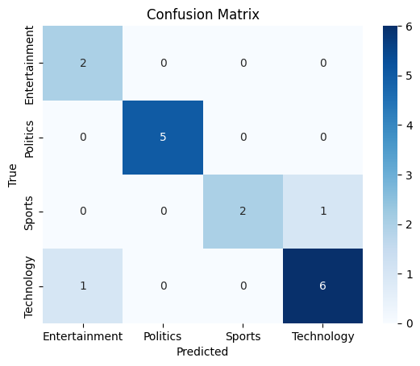

# Text Classification with Naive Bayes

A compact bag-of-words text classifier using `CountVectorizer` + Multinomial Naive Bayes, trained on a synthetic labeled text dataset.

## What it does

1. Loads a CSV of labeled text (`text` and `label` columns).
2. Splits into train/test sets, then converts text into word-count vectors using `CountVectorizer` — fit only on the training set to avoid leaking test-set vocabulary into the model.
3. Trains a `MultinomialNB` classifier on the vectorized training data.
4. Predicts on the test set and reports accuracy.
5. Plots a confusion matrix to show exactly which classes get confused with each other, since accuracy alone doesn't reveal that.

## Concepts covered

- **Bag-of-words vectorization** — `CountVectorizer` turns each document into a vector of word counts, ignoring grammar and word order but capturing which words appear and how often.
- **Multinomial Naive Bayes** — a probabilistic classifier well-suited to word-count features; it's fast, simple, and a strong baseline for text classification.
- **Train/fit separation** — the vectorizer is `.fit_transform()`-ed on training data and only `.transform()`-ed (not re-fit) on test data, so the model is never evaluated using vocabulary it "shouldn't" know about yet.
- **Confusion matrix** — a table of predicted vs. actual labels that shows exactly where a model's mistakes happen (e.g. which two classes it mixes up most), which a single accuracy number can't show.

## Project structure

```
main.py      # full pipeline, organized into functions (config, data loading,
              # vectorization, training, evaluation, visualization)
README.md    # this file
```

The code is organized into small, named functions driven by a single `PipelineConfig` dataclass — `load_dataset`, `vectorize_text`, `train_model`, `evaluate_model`, and `plot_confusion_matrix` — each independently readable, testable, and reusable, tied together by `run_pipeline()`.

## Requirements

```
pandas
matplotlib
seaborn
scikit-learn
```

Install with:

```bash
pip install pandas matplotlib seaborn scikit-learn
```

## How to run

Place `synthetic_text_data.csv` (with `text` and `label` columns) in the same directory as `main.py`, then:

```bash
python main.py
```

## Sample output

Running the script prints the test-set accuracy and displays a confusion matrix heatmap.

**Confusion matrix**




## Notes on this implementation

- The original script imported `CountVectorizer` twice and left `seaborn`, `matplotlib`, `accuracy_score`, and `confusion_matrix` unused — it computed predictions but never evaluated or visualized them. This version removes the duplicate import and completes the evaluation/visualization the imports were set up for.
- Organized into typed, documented functions rather than one flat block, so each stage of the pipeline (loading, vectorizing, training, evaluating, plotting) can be modified or reused independently.
- All tunable parameters (file path, column names, test split, random seed) live in one `PipelineConfig` dataclass instead of being scattered through the code.

## Things I'd like to try next

- Compare `CountVectorizer` against `TfidfVectorizer` to see if weighting rare words differently improves results.
- Try a `SGDClassifier` or `LogisticRegression` baseline alongside Naive Bayes for comparison.
- Add precision/recall/F1 per class, not just overall accuracy, especially if the dataset is imbalanced.

---
*This is a personal learning project, not a production classifier.*
