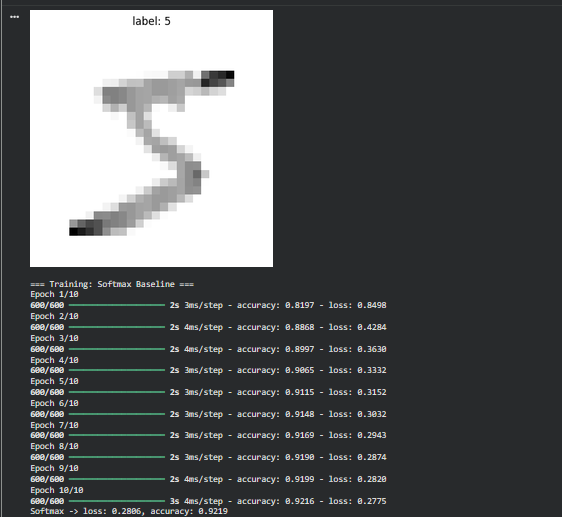
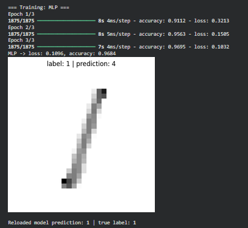

# MNIST Digit Classification — Softmax vs. MLP

A comparison of two neural network architectures for classifying handwritten digits (MNIST): a single-layer softmax classifier and a multi-layer perceptron (MLP). Built to explore how much a couple of hidden layers improve accuracy over a plain linear baseline.

## What it does

1. Loads the MNIST dataset once and normalizes pixel values (shared by both models, in both flat and 2D form).
2. Trains a **softmax baseline** — a single dense layer with softmax activation, equivalent to multinomial logistic regression on flattened pixel values.
3. Trains an **MLP** — the same input flattened internally, passed through two ReLU hidden layers before the softmax output.
4. Evaluates both models on the held-out test set and prints loss/accuracy for comparison.
5. Visualizes a sample digit alongside the MLP's prediction.
6. Saves the trained MLP to disk and reloads it to confirm the saved model reproduces the same prediction.

## Concepts covered

- **Softmax regression as a baseline** — a single dense + softmax layer is essentially multinomial logistic regression; comparing it to a deeper network shows how much hidden layers actually help.
- **Multi-layer perceptron (MLP)** — stacking `Dense(relu)` layers lets the model learn non-linear combinations of pixel values instead of a single linear decision boundary per class.
- **Normalization** — pixel values are scaled from `[0, 255]` to a normalized range before training, which helps gradient-based optimizers converge faster and more reliably.
- **`sparse_categorical_crossentropy`** — used instead of one-hot + `categorical_crossentropy` because labels are given as plain integers (0–9).
- **Model persistence** — `model.save()` / `tf.keras.models.load_model()` demonstrates that a trained model can be serialized and reloaded with identical prediction behavior.

## Project structure

```
main.py      # full pipeline, organized into functions (config, data loading,
              # model architectures, training, evaluation, visualization)
README.md    # this file
```

The code is organized into small, named functions driven by a `PipelineConfig` dataclass — `load_mnist_data`, `build_softmax_model`, `build_mlp_model`, `evaluate_model`, `show_digit` — tied together by `run_pipeline()`.

## Requirements

```
numpy
matplotlib
tensorflow
```

Install with:

```bash
pip install numpy matplotlib tensorflow
```

## How to run

```bash
python main.py
```

MNIST downloads automatically via `tf.keras.datasets.mnist.load_data()` on first run — no separate dataset file needed.

## Results

Actual run on this dataset/config:

| Model | Test Loss | Test Accuracy |
|---|---|---|
| Softmax Baseline (10 epochs) | 0.2806 | 92.19% |
| MLP (3 epochs) | 0.1096 | 96.84% |

The MLP reaches noticeably higher accuracy in far fewer epochs, confirming the two hidden layers capture non-linear structure the single-layer softmax model can't.

**Softmax baseline — training log**



**MLP — training log and sample prediction**



### Observation: live vs. reloaded model disagreement

On one run, the *live* MLP model predicted `4` for a test digit labeled `1`, but after `model.save()` / `load_model()`, the *reloaded* model correctly predicted `1` on the exact same input. Since this architecture has no dropout or batch norm, weights should behave identically before and after serialization — the most likely explanation is that the model's softmax probabilities for `1` and `4` were close together on that particular digit, and small floating-point rounding introduced by save/reload was enough to flip which class had the higher probability via `argmax`. It's not a save/load bug — just a low-confidence prediction getting exposed by the round trip. Printing the full probability vector for that sample (instead of just `argmax`) would confirm this.

## Sample output

Running the script also displays a sample training digit and a test digit alongside the MLP's prediction, then confirms the reloaded model's prediction on that same digit.


## Things I'd like to try next

- Add a CNN (`Conv2D` + `MaxPooling2D`) as a third comparison point — typically the biggest accuracy jump on image data.
- Track training/validation accuracy curves per epoch, not just the final test accuracy.
- Add a confusion matrix to see which digits get misclassified most often (e.g. 4s vs. 9s).
- Print the full softmax probability vector (not just `argmax`) for sample predictions, to check confidence on borderline cases like the `1` vs. `4` mix-up observed above.

## References

- [GeeksforGeeks — Machine Learning Projects](https://www.geeksforgeeks.org/machine-learning/machine-learning-projects/) — used as a general reference/inspiration while working on this project.

---
*This is a personal learning project, not a production classifier.*
