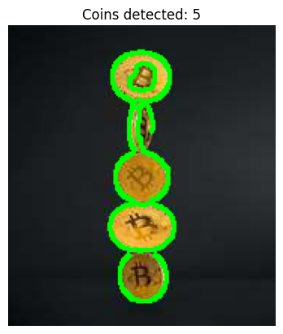

# Coin Counting with Contour Detection (OpenCV)

A classical computer vision pipeline that counts coins in an image using edge detection and contour finding — no machine learning involved, just image processing.

## What it does

1. Loads the source image, raising a clear error if the file can't be found.
2. Converts to grayscale and applies a Gaussian blur to reduce noise before edge detection.
3. Runs Canny edge detection to find edges, then dilates them slightly to close small gaps (so a coin's outline forms one continuous closed shape rather than a broken one).
4. Finds external contours (outer boundaries) in the dilated edge map, filtering out tiny contours that are too small to plausibly be a coin (noise/artifacts).
5. Draws the detected contours onto the original image and displays it, alongside the final count.

## Concepts covered

- **Gaussian blur before edge detection** — edge detectors like Canny are sensitive to noise; blurring first smooths out small pixel-level variations so only genuine object edges get picked up, not texture noise.
- **Canny edge detection** — a two-threshold edge detector (`canny_low`/`canny_high`) that finds strong edges and connects them to nearby weaker ones, producing a clean binary edge map.
- **Dilation to close gaps** — edges from Canny are sometimes broken into small disconnected segments; dilating them slightly bridges small gaps so contour detection sees one continuous coin outline instead of several fragments.
- **Contour detection (`RETR_EXTERNAL`)** — extracts only the outermost boundary of each connected shape, ideal for counting whole objects like coins rather than every internal edge or texture line.
- **Contour area filtering** — real-world edge detection often picks up small noise blobs as "contours"; filtering by minimum area is a simple way to discard those before counting.

## Project structure

```
main.py      # full pipeline, organized into functions (config, image loading,
              # preprocessing, edge detection, contour finding, visualization)
README.md    # this file
```

The code is organized into small, named functions driven by a `PipelineConfig` dataclass — `load_image`, `preprocess`, `detect_edges`, `find_coin_contours`, `draw_contours`, `show_image` — tied together by `run_pipeline()`.

## Requirements

```
opencv-python
matplotlib
```

Install with:

```bash
pip install opencv-python matplotlib
```

## How to run

Place your source image (e.g. `coins.png`) in the same directory as `main.py`, then:

```bash
python main.py
```

## Sample output

**Original**


**Detected coins**




## Things I'd like to try next

- Try `cv2.HoughCircles` as an alternative/complementary method, since coins are circular — it might be more robust than generic contour detection for this specific shape.
- Add adaptive thresholding as a preprocessing option for images with uneven lighting.
- Estimate coin denominations by contour size/radius, not just count total coins.

## References

- [GeeksforGeeks — Machine Learning Projects](https://www.geeksforgeeks.org/machine-learning/machine-learning-projects/) — used as a general reference/inspiration while working on this project.


---
*This is a personal learning project, not a production coin-counting system.*
