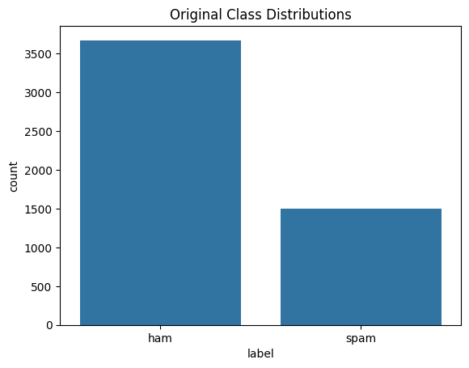
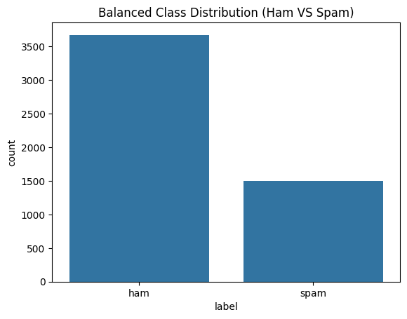
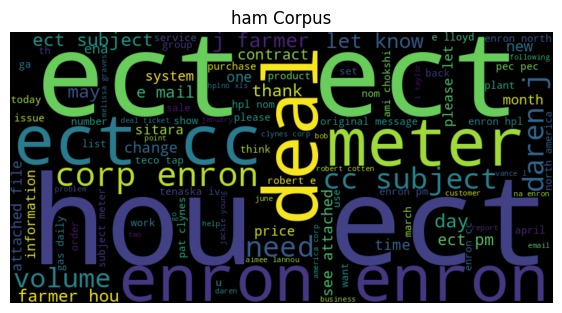
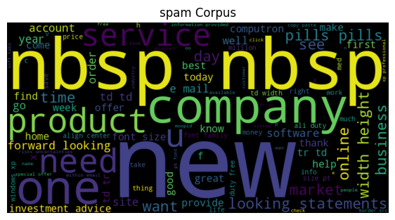
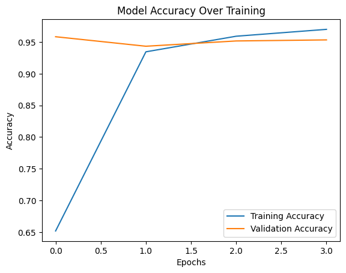

# Email Spam Classifier (Personal Project)

This is a personal project I built to learn how to classify text using a neural network — specifically, telling spam emails apart from legitimate ("ham") ones. It's an end-to-end pipeline: load raw email data, clean it up, turn it into numbers a model can use, train an LSTM (a type of recurrent neural network), and check how well it performs.

## What it does

1. Loads a labeled dataset of emails (`spam_ham_dataset.csv`) — each row has the email text and a label (`spam` or `ham`).
2. Balances the dataset — ham emails outnumber spam ones, so I undersample ham to avoid the model just learning to always guess "ham."
3. Cleans the text — removes the `Subject` header, punctuation, and common stopwords ("the," "and," "is," etc.) that don't help distinguish spam from ham.
4. Visualizes the data — word clouds show which words are most common in each class, just to build intuition before training anything.
5. Converts text to numbers — a tokenizer maps each word to an integer, and sequences are padded/truncated to a fixed length so they can be fed into the model.
6. Builds and trains an LSTM model — learns to predict spam vs. ham from the padded sequences.
7. Evaluates the model — reports test accuracy/loss and plots training vs. validation accuracy to check for overfitting.

## Concepts I used and learned

- **Class imbalance & undersampling** — when one class has way more examples than another, a model can get "good" accuracy by just predicting the majority class every time. Undersampling the majority class forces it to actually learn the difference.
- **Text preprocessing (NLP basics)** — lowercasing, punctuation removal, and stopword removal are standard steps to reduce noise in text data before modeling.
- **Tokenization & padding** — neural networks need fixed-size numeric input, not raw text. A tokenizer builds a word → integer vocabulary, and padding/truncating makes every sequence the same length.
- **Train/test split & data leakage** — the tokenizer is fit only on the training data. Fitting it on the full dataset (including test data) would leak information the model shouldn't see yet, making evaluation results look better than they really are.
- **Embeddings** — instead of treating word IDs as arbitrary numbers, an Embedding layer learns a dense vector representation for each word, capturing some notion of meaning/similarity.
- **LSTM (Long Short-Term Memory)** — a type of recurrent neural network that processes text word-by-word and can "remember" earlier context, which matters because word order affects meaning.
- **Binary classification with sigmoid output** — since there are only two classes (spam/ham), the final layer outputs a single probability between 0 and 1 via a sigmoid activation, and binary cross-entropy is used as the loss function.
- **Early stopping & learning rate scheduling** — `EarlyStopping` stops training once validation accuracy stops improving (and restores the best weights seen), and `ReduceLROnPlateau` shrinks the learning rate when validation loss plateaus. Both help avoid overfitting and wasted training time.
- **Overfitting** — checked visually by comparing training accuracy vs. validation accuracy over epochs; if training accuracy keeps climbing while validation accuracy stalls or drops, that's a sign the model is memorizing rather than generalizing.

## Sample outputs

The script generates several plots along the way. Screenshots go in an `images/` folder next to `main.py` — run the script, save each plot, then drop them in:

```
images/
├── class_distribution_original.png
├── class_distribution_balanced.png
├── wordcloud_ham.png
├── wordcloud_spam.png
└── training_accuracy.png
```

**Original class distribution** (before balancing)



**Balanced class distribution** (ham undersampled to match spam)



**Word cloud — Ham emails**



**Word cloud — Spam emails**



**Training vs. validation accuracy**



## Project structure

```
main.py      # full pipeline, organized into sections (config, data loading,
              # cleaning, tokenization, model, training, evaluation)
README.md    # this file
images/       # (optional) saved plot screenshots referenced above
```

The code is organized into small functions driven by a single `PipelineConfig` object, so each step (loading, cleaning, tokenizing, training, etc.) is easy to read, tweak, or rerun on its own.

## Requirements

```
numpy
pandas
matplotlib
seaborn
nltk
wordcloud
tensorflow
scikit-learn
```

Install with:

```bash
pip install numpy pandas matplotlib seaborn nltk wordcloud tensorflow scikit-learn
```

## How to run

Place `spam_ham_dataset.csv` in the same folder as `main.py`, then:

```bash
python main.py
```

To skip the plots/word clouds (e.g. running headless):

```python
from main import PipelineConfig, run_pipeline

run_pipeline(PipelineConfig(show_plots=False))
```


## Things I'd like to try next

- Compare the LSTM against simpler baselines (e.g. TF-IDF + logistic regression) to see how much the extra complexity actually helps.
- Try pretrained word embeddings (like GloVe) instead of learning embeddings from scratch.
- Add a confusion matrix / precision-recall breakdown instead of just accuracy, since false positives (flagging real email as spam) and false negatives matter differently in practice.
- Experiment with a Bidirectional LSTM or a simple attention mechanism.

## References

- [GeeksforGeeks — Machine Learning Projects](https://www.geeksforgeeks.org/machine-learning/machine-learning-projects/) — used as a general reference/inspiration while working on this project.

---
*This is a personal learning project, not a production spam filter.*
