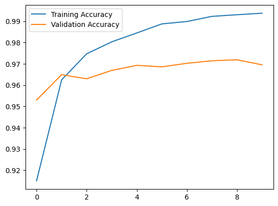
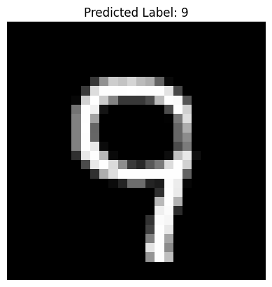
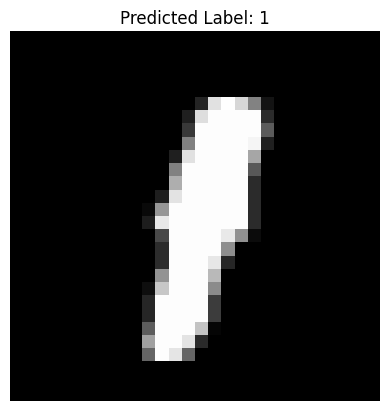
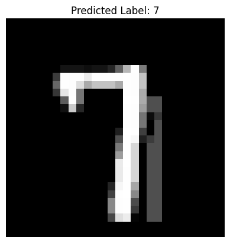
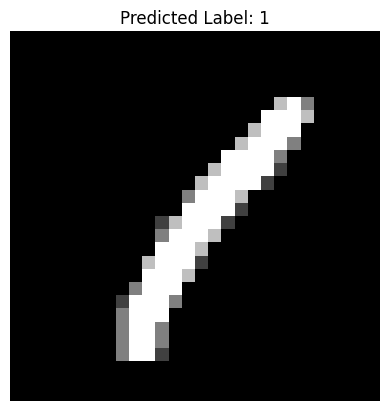
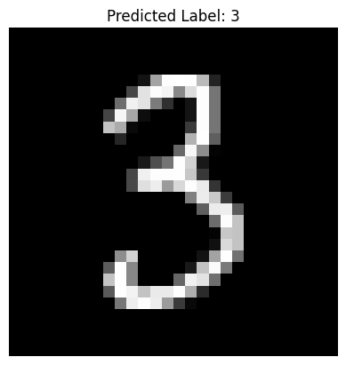

# Digit Classification from CSV Pixel Data (Keras)

A small dense neural network that classifies handwritten digits from a Kaggle-style CSV dataset, where each row is a label followed by 784 flattened pixel values (a 28x28 grayscale image).

## What it does

1. Loads the training CSV and separates it into raw pixel features (`X`) and the label column (`y`).
2. Cleans and preprocesses `X`: coerces to numeric, fills missing values, normalizes pixel values to `[0, 1]`, and reshapes each row back into a 28x28x1 image.
3. One-hot encodes the labels into 10-class vectors.
4. Splits the data into training and validation sets.
5. Builds a small dense classifier (`Flatten` → `Dense(128)` → `Dense(64)` → `Dense(10, softmax)`).
6. Trains the model, tracking validation accuracy each epoch.
7. Evaluates on the validation set and plots training vs. validation accuracy curves.
8. Loads a separate test CSV (no labels), runs predictions, and displays a few sample images alongside their predicted labels.

## Concepts covered

- **Flattened image CSVs** — a common way image datasets are distributed for tabular-style processing (e.g. Kaggle's Digit Recognizer competition): each row is one image, with pixel values as individual columns instead of a 2D array, so it needs to be reshaped back into image form before feeding into a model that expects spatial structure.
- **Defensive data coercion** — converting to numeric and filling missing values (`pd.to_numeric(errors="coerce")` + `fillna(0)`) guards against unexpected non-numeric or missing entries in the raw CSV before doing any math on it.
- **One-hot encoding for multi-class classification** — `to_categorical` converts integer labels (0-9) into 10-element vectors, matching the shape expected by a `softmax` output layer trained with `categorical_crossentropy`.
- **Train/validation split** — `train_test_split` carves out part of the labeled training data to monitor the model during training, separate from the truly-unlabeled test set used only for final predictions.

## Project structure

```
main.py      # full pipeline, organized into functions (config, data loading,
              # preprocessing, model, training, evaluation, prediction preview)
README.md    # this file
```

The code is organized into small, named functions driven by a `PipelineConfig` dataclass — `load_train_data`, `preprocess_features`, `preprocess_labels`, `build_model`, `train_model`, `evaluate_model`, `load_test_data`, `preview_predictions` — tied together by `run_pipeline()`.

## Requirements

```
numpy
pandas
matplotlib
scikit-learn
tensorflow
```

Install with:

```bash
pip install numpy pandas matplotlib scikit-learn tensorflow
```

## How to run

Update `PipelineConfig.train_csv_path` and `PipelineConfig.test_csv_path` to point to your actual CSV files, then:

```bash
python main.py
```

## Sample output

Running the script prints shape/accuracy info as it progresses, plots a training/validation accuracy curve, and displays a few sample test images with their predicted labels.

**Training curve**



**Sample predictions**




---
*This is a personal learning project, not a production classifier.*
