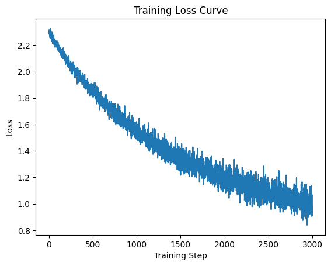

# MNIST Digit Classification with Logistic Regression (PyTorch)

A single-layer logistic regression model trained on MNIST using PyTorch — the simplest possible neural network for this task (a linear layer + softmax), useful as a baseline before trying deeper architectures.

## What it does

1. Downloads (if needed) and loads the MNIST train/test datasets via `torchvision`.
2. Defines a `LogisticRegression` model: a single `nn.Linear` layer mapping 784 flattened pixel values to 10 class scores.
3. Trains with SGD and cross-entropy loss (which applies softmax internally), logging loss periodically and recording it every step.
4. Evaluates accuracy on the 10,000-image test set.
5. Plots the training loss curve.

## Concepts covered

- **Logistic regression as a neural network** — a single linear layer followed by softmax (handled internally by `CrossEntropyLoss`) is mathematically equivalent to multinomial logistic regression; it's a useful floor to compare more complex models against.
- **`nn.CrossEntropyLoss`** — combines `LogSoftmax` and negative log-likelihood loss in one step, so the model itself only needs to output raw class scores (logits), not probabilities.
- **DataLoader & batching** — `torch.utils.data.DataLoader` handles batching and shuffling automatically, so training loops don't need to manually slice the dataset.
- **Training loop structure** — `optimizer.zero_grad()` → forward pass → `loss.backward()` → `optimizer.step()` is the standard PyTorch training pattern, repeated per batch.
- **`model.eval()` + `torch.no_grad()`** — evaluation mode disables training-only behaviors (relevant for models with dropout/batchnorm) and `no_grad()` skips gradient tracking during inference, saving memory and computation.

## Project structure

```
main.py      # full pipeline, organized into functions/classes (config, data loading,
              # model definition, training, evaluation, visualization)
README.md    # this file
```

The code is organized into a `PipelineConfig` dataclass, a `LogisticRegression` model class, and small functions — `load_data`, `train_model`, `evaluate_model`, `plot_loss_curve` — tied together by `run_pipeline()`.

## Requirements

```
torch
torchvision
matplotlib
```

Install with:

```bash
pip install torch torchvision matplotlib
```

## How to run

```bash
python main.py
```

MNIST downloads automatically into `./data` on first run — no separate dataset file needed.

## Sample output

Running the script logs training loss every 100 steps, plots a full loss curve, and prints final test accuracy.

**Training loss curve**




## Things I'd like to try next

- Add a hidden layer (turning this into a small MLP) and compare accuracy against the pure logistic regression baseline.
- Track test accuracy per epoch instead of only at the very end, to see how quickly the model converges.
- Try `Adam` instead of plain SGD and compare convergence speed.
- Move training to GPU (`.to(device)`) if available, for faster iteration on larger models.

## References

- [GeeksforGeeks — Machine Learning Projects](https://www.geeksforgeeks.org/machine-learning/machine-learning-projects/) — used as a general reference/inspiration while working on this project.

---
*This is a personal learning project, not a production classifier.*
