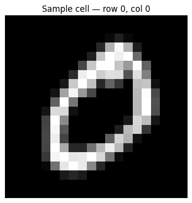
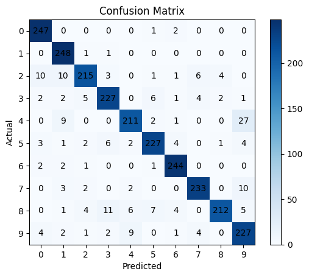

# Handwritten Digit Classification with k-Nearest Neighbors (OpenCV)

A classic k-NN digit classifier built on OpenCV's `cv2.ml.KNearest`, trained on the standard "digits" sprite sheet — a single image containing a grid of small handwritten digit samples (10 classes, arranged in row-blocks).

## What it does

1. Loads the sprite sheet image and converts it to grayscale.
2. Splits the grid into individual digit cells (50 rows × 100 columns).
3. Divides the columns in half: left half becomes training data, right half becomes test data. Builds matching integer labels (0–9) based on which row-block each cell belongs to.
4. Trains a k-NN classifier (`k=3` by default) on the training cells.
5. Predicts labels for the test cells and reports overall accuracy.
6. Visualizes a sample digit cell and a confusion matrix of predicted vs. actual labels.

## Concepts covered

- **k-Nearest Neighbors (k-NN)** — a simple, non-parametric classifier that labels a new sample based on the majority label among its `k` closest training samples (by pixel-distance here). No real "training" happens beyond storing the data — all the work happens at prediction time.
- **Sprite-sheet dataset layout** — a common way to distribute small image datasets as one large grid image instead of thousands of individual files; splitting it into a train/test set requires careful indexing (here, by column) rather than a random shuffle.
- **Grayscale flattening** — each digit cell (originally 2D pixels) is flattened into a 1D feature vector so it can be compared to other digits via distance metrics.
- **OpenCV API version handling** — `cv2.ml.KNearest.create()` vs. `cv2.ml.KNearest_create()` differ across OpenCV versions; the code tries both so it works regardless of which version is installed.
- **Confusion matrix** — shows exactly which digits get mistaken for which (e.g. is `3` confused with `8` more than with `1`?), which a single accuracy percentage can't reveal.

## Project structure

```
main.py      # full pipeline, organized into functions (config, data loading,
              # cell splitting, k-NN training/prediction, evaluation, visualization)
README.md    # this file
```

The code is organized into small, named functions driven by a `PipelineConfig` dataclass — `load_digit_grid`, `split_into_cells`, `prepare_datasets`, `train_and_predict`, `compute_accuracy`, `plot_confusion_matrix` — tied together by `run_pipeline()`.

## Requirements

```
numpy
matplotlib
opencv-python
```

Install with:

```bash
pip install numpy matplotlib opencv-python
```

## How to run

Place the digit sprite sheet (e.g. `digits1.png`) in the same directory as `main.py`, then:

```bash
python main.py
```

## Sample output

Running the script displays a sample digit cell, prints the test accuracy, and shows a confusion matrix.

**Sample digit cell**



**Confusion matrix**




## Things I'd like to try next

- Try different values of `k` and plot accuracy vs. `k` to find the best neighbor count.
- Compare against a different distance metric or a different classifier (e.g. SVM) on the same data split.
- Add per-class accuracy/precision so it's clear if some digits are harder to classify than others.

## References

- [GeeksforGeeks — Machine Learning Projects](https://www.geeksforgeeks.org/machine-learning/machine-learning-projects/) — used as a general reference/inspiration while working on this project.

---
*This is a personal learning project, not a production OCR system.*
