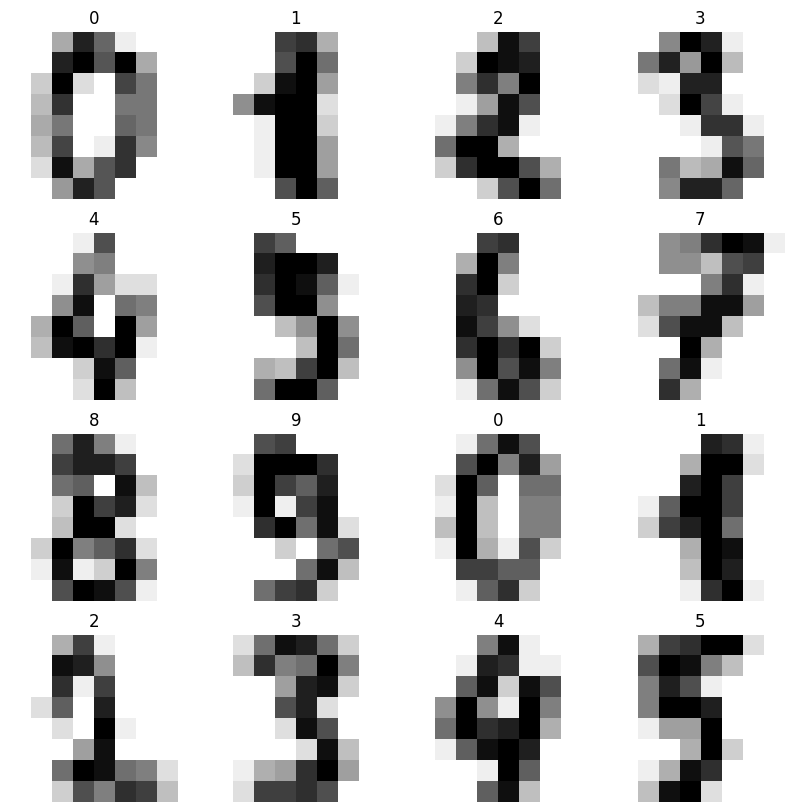
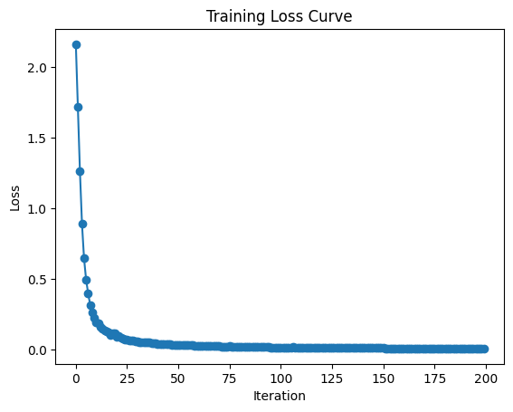
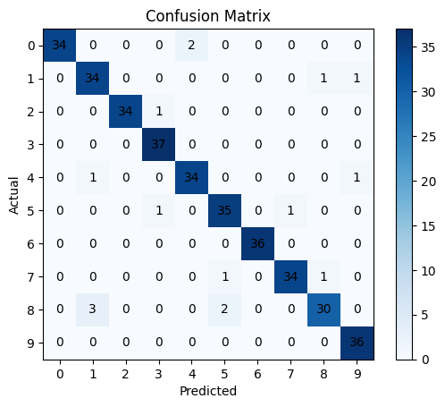

# Handwritten Digit Classification with MLPClassifier (scikit-learn)

A small multi-layer perceptron trained on scikit-learn's built-in `digits` dataset — 1,797 low-resolution (8x8) grayscale images of handwritten digits, 10 classes (0–9).

## What it does

1. Loads the `digits` dataset from `sklearn.datasets`.
2. Previews a grid of sample digit images with their true labels.
3. Flattens each 8x8 image into a 64-value feature vector, then splits into train/test sets (stratified, so each digit class is proportionally represented in both splits).
4. Trains an `MLPClassifier` (one hidden layer of 15 units, logistic activation, SGD solver).
5. Plots the training loss curve recorded during fitting.
6. Predicts on the test set, reports accuracy, and shows a confusion matrix.

## Concepts covered

- **Multi-layer perceptron (MLP)** — a small feedforward neural network; here just one hidden layer (15 units) is enough to get strong accuracy on this relatively simple, low-resolution dataset.
- **Stratified train/test split** — `train_test_split(..., stratify=y)` ensures each digit class appears in the same proportion in both the training and test sets, avoiding a split that's accidentally skewed toward or away from certain digits.
- **Image flattening** — each 8x8 image (a 2D grid of pixel intensities) is reshaped into a 1D vector of 64 values, since a standard MLP expects flat feature vectors, not 2D images.
- **Loss curve** — plotting `model.loss_curve_` over training iterations shows whether the model converged smoothly or is still improving when training stopped.
- **Confusion matrix** — reveals exactly which digits get confused with which (e.g. `8` vs. `3`), information a single accuracy number can't provide.

## Project structure

```
main.py      # full pipeline, organized into functions (config, data loading,
              # preview, splitting, model, training, evaluation, visualization)
README.md    # this file
```

The code is organized into small, named functions driven by a `PipelineConfig` dataclass — `load_data`, `prepare_datasets`, `build_mlp`, `plot_loss_curve`, `evaluate_model`, `plot_confusion_matrix` — tied together by `run_pipeline()`.

## Requirements

```
matplotlib
scikit-learn
```

Install with:

```bash
pip install matplotlib scikit-learn
```

## How to run

```bash
python main.py
```

No external dataset file needed — `sklearn.datasets.load_digits()` ships the data with scikit-learn.

## Sample output

Running the script shows a 4x4 grid of sample digits, prints per-iteration training loss (verbose), plots the loss curve, prints test accuracy, and displays a confusion matrix.

**Sample digits**



**Training loss curve**



**Confusion matrix**




## Things I'd like to try next

- Try a second hidden layer or more units to see if accuracy improves further on this dataset.
- Compare `MLPClassifier` against a simpler baseline (e.g. `LogisticRegression` or `KNeighborsClassifier`) on the same split.
- Use `GridSearchCV` to tune `alpha`, `learning_rate_init`, and hidden layer size systematically instead of guessing.
- Show a handful of specific misclassified digits alongside their predicted vs. true labels.

## References

- [GeeksforGeeks — Machine Learning Projects](https://www.geeksforgeeks.org/machine-learning/machine-learning-projects/) — used as a general reference/inspiration while working on this project.

---
*This is a personal learning project, not a production OCR system.*
