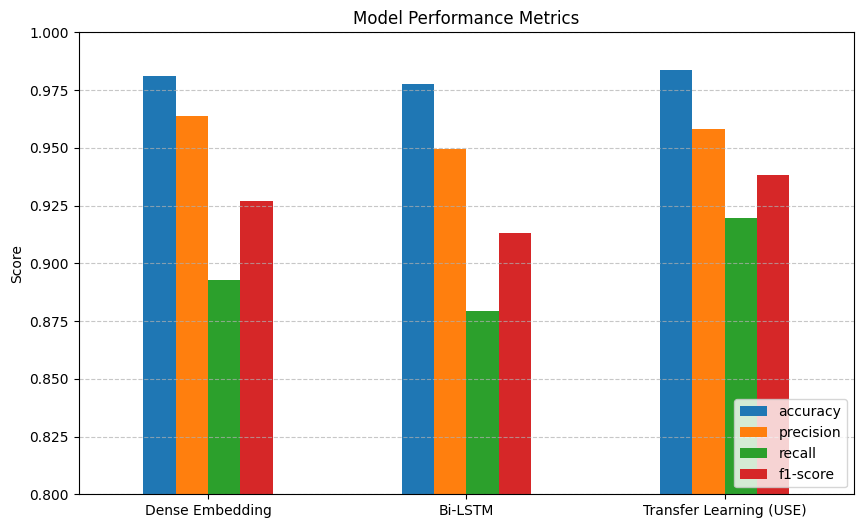
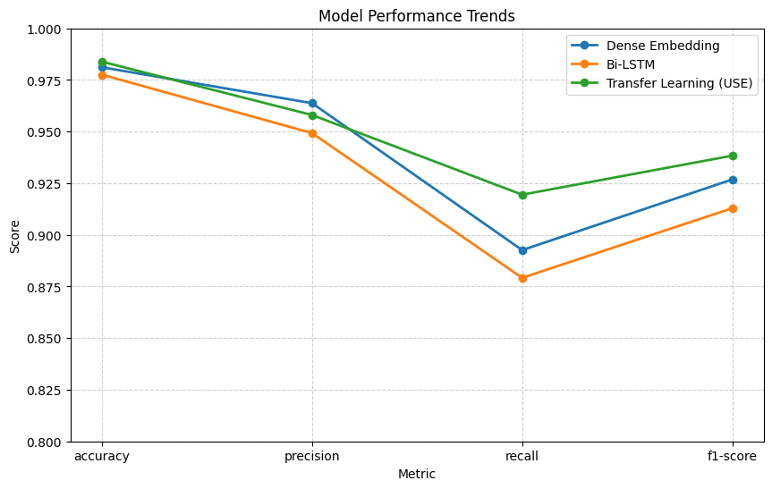

# SMS Spam Classification — Model Comparison

A compact comparison of three text-classification architectures for detecting spam SMS messages, built to explore how model complexity trades off against performance on a small text-classification task.

## Overview

The notebook trains and evaluates three models on the same train/test split:

| Model | Approach |
|---|---|
| **Dense Embedding** | Learned word embeddings, average-pooled, fed into a small dense head. Fast, simple baseline. |
| **Bi-LSTM** | Two stacked Bidirectional LSTM layers to capture sequential/contextual patterns in the text. |
| **Transfer Learning (USE)** | Pretrained [Universal Sentence Encoder](https://tfhub.dev/google/universal-sentence-encoder/4) (frozen) with a small trainable classification head on top. |

Each model outputs a single sigmoid probability (spam vs. ham) and is scored on accuracy, precision, recall, and F1.

## Concepts covered

- **Text vectorization** — `TextVectorization` converts raw strings to integer sequences (fit only on training data to avoid leaking test-set vocabulary into the model).
- **Embeddings vs. pretrained sentence encoders** — the first two models learn embeddings from scratch; the third reuses a pretrained encoder (transfer learning) rather than learning representations from this dataset alone.
- **Bidirectional LSTMs** — read a sequence both forward and backward, useful when context from later words informs the meaning of earlier ones.
- **Transfer learning with frozen weights** — the USE encoder is set to `trainable=False`, so only the small classification head is trained, which helps on small datasets and reduces training time.
- **Multi-model evaluation** — accuracy alone can be misleading on imbalanced text data, so precision, recall, and F1 are tracked side by side for a fuller picture of each model's trade-offs.

## Project structure

```
main.py      # full script, organized into 8 labeled steps
README.md    # this file
```

The script runs top to bottom in 8 steps: load data → dataset stats → text vectorization → model architectures → train/evaluate helpers → train all models → results table → visualize comparisons.

## Requirements

```
numpy
pandas
matplotlib
tensorflow
tensorflow_hub
scikit-learn
```

Install with:

```bash
pip install numpy pandas matplotlib tensorflow tensorflow_hub scikit-learn
```

## How to run

1. Place `spam.csv` (the [SMS Spam Collection dataset](https://archive.ics.uci.edu/dataset/228/sms+spam+collection) format: `v1` = label, `v2` = message text) in the same directory as `main.py`.
2. Run:

```bash
python main.py
```

Note: the Universal Sentence Encoder model (~1GB) is downloaded from TensorFlow Hub on first run, so the USE model's first training pass will take noticeably longer.

## Sample output

Running the notebook produces a results table and two comparison charts (bar chart and line chart) across accuracy, precision, recall, and F1 for all three models.

**Model performance comparison**



**Model performance trends**



> To save these for the `images/` folder, add `plt.savefig("images/model_performance_bars.png", bbox_inches="tight")` (and similarly for the line chart) right before each `plt.show()` call.

## Notes on this implementation

- Vocabulary size for the embedding layers is read directly from the fitted vectorizer (`text_vec.vocabulary_size()`) rather than hardcoded, so it always matches what the vectorizer actually learned.
- The Bi-LSTM model's final layer already returns a 2D tensor, so the unnecessary `Flatten()` step was removed before the dense head.
- All three models share one `compile_and_fit` / `evaluate` helper pair, and are trained through a single loop over `model_builders`, so adding a fourth architecture later only requires adding one dictionary entry — not duplicating a training block.
- The script is organized into 8 labeled steps (see comments in `main.py`) rather than one long unstructured block, while staying leaner than the original (129 lines vs. 145).

## Things I'd like to try next

- Add k-fold cross-validation instead of a single train/test split for more reliable metric estimates.
- Try a lightweight transformer (e.g. DistilBERT) as a fourth comparison point.
- Report a confusion matrix per model, since precision/recall trade-offs matter more than accuracy for spam filtering.
- Fine-tune the USE encoder (`trainable=True`) and compare against the frozen version.

## References

- [GeeksforGeeks — Machine Learning Projects](https://www.geeksforgeeks.org/machine-learning/machine-learning-projects/) — used as a general reference/inspiration while working on this project.

---
*This is a personal learning project exploring model comparison for text classification, not a production spam filter.*
