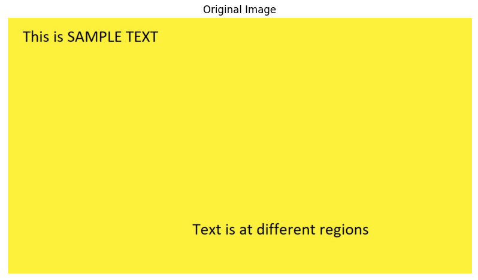
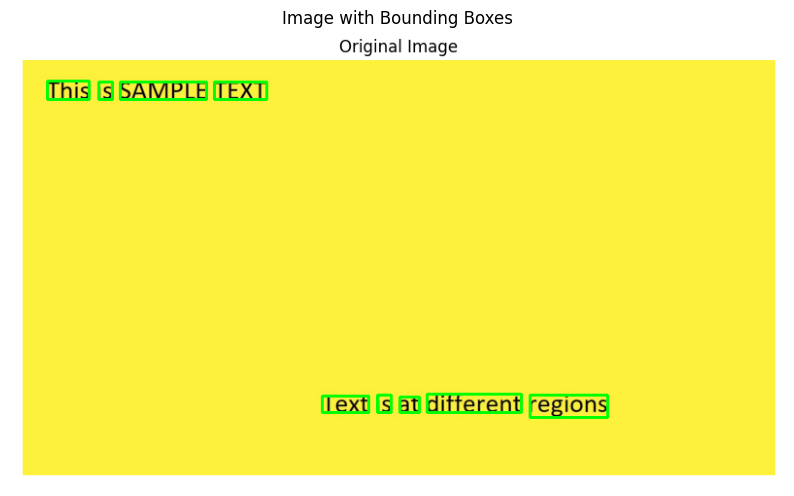

# OCR Text Extraction with pytesseract

Extracts text from an image using Tesseract OCR (via `pytesseract`), and visualizes exactly which words were detected by drawing bounding boxes around them.

## What it does

1. Loads the source image and converts it to RGB (OpenCV loads as BGR by default; matplotlib and pytesseract expect RGB).
2. Displays the original image.
3. Runs OCR (`image_to_string`) and prints the extracted text.
4. Runs OCR again with layout data (`image_to_data`), filters down to only real, non-empty word-level detections, and draws a bounding box around each one.
5. Displays the image with bounding boxes overlaid.

## Concepts covered

- **Tesseract OCR** — an open-source OCR engine; `pytesseract` is a thin Python wrapper around it. `image_to_string` gives plain extracted text, while `image_to_data` gives structured output (per-detection position, size, and confidence).
- **OCR hierarchy levels** — `image_to_data` doesn't just return word boxes; it returns *every* level of Tesseract's internal document hierarchy (page → block → paragraph → line → word) mixed into the same flat arrays. Drawing a box for every entry without filtering draws redundant, overlapping boxes for the whole page, each block, each paragraph, and each line — on top of the actual word boxes you probably wanted.
- **Confidence filtering** — each detection has a `conf` score; entries above non-word hierarchy levels typically report `-1` (no confidence), and low-confidence word detections are often OCR noise/garbage rather than real text. Filtering on confidence (and on non-empty text) is how you isolate meaningful word detections.
- **BGR vs. RGB** — OpenCV loads and represents images in BGR channel order by default, but matplotlib (and pytesseract's color expectations) assume RGB, so a color-channel conversion is needed before displaying or processing further, or colors/OCR results can come out wrong.

## Project structure

```
main.py      # full pipeline, organized into functions (config, image loading,
              # text extraction, word-box extraction/filtering, visualization)
README.md    # this file
```

The code is organized into small, named functions driven by a `PipelineConfig` dataclass — `load_image`, `extract_text`, `extract_word_boxes`, `draw_word_boxes`, `show_image` — tied together by `run_pipeline()`.

## Requirements

```
opencv-python
pytesseract
matplotlib
```

Install with:

```bash
pip install opencv-python pytesseract matplotlib
```

You'll also need the Tesseract OCR engine itself installed on your system (`pytesseract` is just a wrapper — it calls out to the `tesseract` binary):

```bash
# macOS
brew install tesseract

# Ubuntu/Debian
sudo apt install tesseract-ocr
```

## How to run

Place your source image (e.g. `Original-Image.png`) in the same directory as `main.py`, then:

```bash
python main.py
```

## Sample output

**Original image**



**Image with bounding boxes**



## Things I'd like to try next

- Print each detected word alongside its confidence score, to spot low-confidence/likely-wrong detections at a glance.
- Try preprocessing (grayscale, thresholding, deskewing) before OCR, since Tesseract's accuracy is very sensitive to image quality.
- Group word boxes back into lines/paragraphs (using the `line_num`/`par_num` fields already present in `image_to_data`) for structured text reconstruction instead of just a flat word list.

## References

- [GeeksforGeeks — Machine Learning Projects](https://www.geeksforgeeks.org/machine-learning/machine-learning-projects/) — used as a general reference/inspiration while working on this project.

---
*This is a personal learning project, not a production OCR pipeline.*
